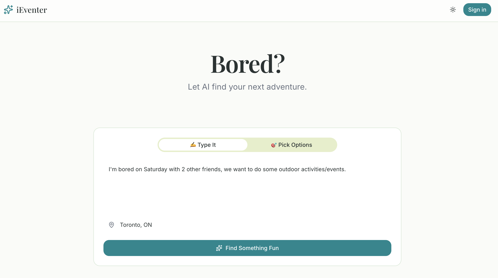
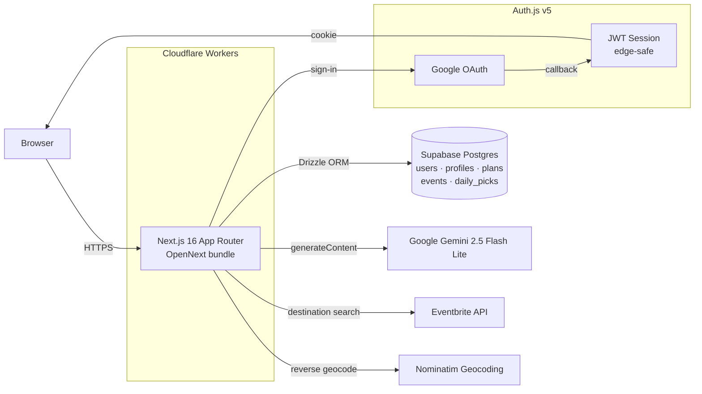

# 🎉 iEventer

> **Bored? Let AI find your next adventure.**

An AI-powered event and activity discovery app that learns your interests, mood, and context — then suggests creative things to do, both AI-generated activity ideas AND real events happening near you. Unlike Eventbrite (transactional) or Meetup (static directory), iEventer acts as a **personal companion** that knows you.

🌐 **[Live demo →](https://ieventer.mikedohyunlim.workers.dev)** &nbsp;·&nbsp;
📜 [Changelog](./CHANGELOG.md) &nbsp;·&nbsp;
🗺️ [Roadmap](./ROADMAP.md) &nbsp;·&nbsp;
🚀 [Deploy guide](./docs/DEPLOY.md)

[](https://github.com/mikeylim/iEventer/actions/workflows/ci.yml)


---

<!-- Screenshots will render once captured (see docs/screenshots/README.md) -->
<p align="center">
  
  
</p>

---

## ✨ Why iEventer?

- **It knows you.** Onboarding maps you to 3+ of 45 interests across 12 categories, then every Gemini prompt and event pick is conditioned on your profile.
- **One curated pick a day.** "Today's Surprise Pick" picks one event each day for you, with a personalized AI explanation of why. Built to fight decision paralysis.
- **Multi-event plans, optimized.** Add multiple events to a plan, then let Gemini compute the best route, travel tips between stops, and an estimated time + cost.
- **AI suggestions + real events, side by side.** Gemini generates novel activity ideas with step-by-step how-tos and budget; Eventbrite supplies the live happenings. Same UI, both at once.

## ✅ What's working today

- **Auth** — Google OAuth via Auth.js v5, JWT sessions (edge-compatible), Drizzle adapter for user persistence
- **Onboarding** — interactive interest selection, location capture, sticky bottom continue bar
- **AI suggestions** — Gemini 2.5 Flash Lite with structured JSON output (`responseMimeType: "application/json"`) and a hardened parser that recovers from common malformations
- **Real events** — Eventbrite Destination Search API, geocoded via Nominatim, with sort/filter (when, price, dynamic category) and infinite-scroll pagination
- **Plans** — persisted in Postgres, optimistic add/remove with rollback, AI-cached optimized routes
- **Daily surprise pick** — deterministic interest rotation by day-of-year, 30-day exclusion of recently-picked events, regenerate / dismiss / add-to-plan actions
- **Light + dark mode** with `next-themes`, system preference detection
- **Production deploy** — Cloudflare Workers via `@opennextjs/cloudflare`

## 🧱 Tech Stack

| Layer | Tools |
|-------|-------|
| **Frontend** | Next.js 16 (App Router) · TypeScript · Tailwind CSS v4 · shadcn/ui · React Hook Form · Zod |
| **Backend** | Next.js Server Actions · Drizzle ORM · PostgreSQL (Supabase) |
| **Auth** | Auth.js (NextAuth) v5 with Google OAuth · JWT sessions · Drizzle adapter |
| **AI** | Google Gemini 2.5 Flash Lite with structured JSON responses |
| **External APIs** | Eventbrite Destination Search · Nominatim (geocoding) |
| **Hosting** | Cloudflare Workers via `@opennextjs/cloudflare` |
| **Theming** | `next-themes` (light/dark/system), Playfair Display + Inter via `next/font` |

## 🏗️ Architecture



## 📁 Project structure

```
src/
├── app/
│   ├── api/
│   │   ├── auth/[...nextauth]/   # Auth.js handlers
│   │   ├── cron/daily-picks/     # Daily-pick generation endpoint (CRON_SECRET protected)
│   │   ├── discover/             # Eventbrite event search (renamed from /events to dodge ad blockers)
│   │   ├── optimize-route/       # Gemini multi-event route optimizer
│   │   └── suggest/              # Gemini activity suggestions
│   ├── auth/signin/              # Sign-in page
│   ├── onboarding/               # First-time user flow
│   ├── plans/                    # Saved plans list and detail
│   ├── HomeClient.tsx            # Main discovery UI (client island)
│   └── page.tsx                  # Server-rendered home (fetches session + current plan + daily pick)
├── components/
│   ├── ui/                       # shadcn/ui primitives (Button, Tabs, Avatar, etc.)
│   ├── DailyPickCard.tsx         # Cinematic 21:9 hero
│   ├── EventCard.tsx
│   ├── AISuggestionCard.tsx
│   ├── RouteTimelineNode.tsx
│   ├── ThemeProvider.tsx
│   ├── ThemeToggle.tsx
│   └── UserNav.tsx
├── db/
│   ├── client.ts                 # Drizzle/postgres-js client
│   ├── schema.ts                 # 11-table schema
│   └── seed.ts                   # 45 interests across 12 categories
├── lib/
│   ├── auth.config.ts            # Edge-safe Auth.js config (JWT)
│   ├── auth.ts                   # Full server-side auth (with Drizzle adapter)
│   ├── dailyPick.ts              # Daily-pick generation logic
│   ├── eventbrite.ts             # Eventbrite + geocoding helpers
│   ├── parseAiJson.ts            # Hardened Gemini JSON parser
│   ├── plans.ts                  # Plan server actions (CRUD + optimistic updates)
│   ├── session.ts                # getSessionProfile() — user + interests + profile in one query
│   └── interests.ts              # Interest seed data
└── ...
```

## 🚀 Run locally

### 1. Clone & install

```bash
git clone https://github.com/mikeylim/iEventer.git
cd iEventer
npm install
```

### 2. Create accounts (all have free tiers)

- **[Supabase](https://supabase.com/dashboard)** — Postgres database
- **[Google Cloud Console](https://console.cloud.google.com/)** — OAuth client credentials
- **[Google AI Studio](https://aistudio.google.com/apikey)** — Gemini API key
- **[Eventbrite](https://www.eventbrite.com/platform/api-keys)** — private API token

### 3. Configure environment variables

```bash
cp .env.example .env.local
```

Fill in every key — see `.env.example` for inline help and links.

### 4. Initialize the database

```bash
npm run db:push   # apply schema to Supabase
npm run db:seed   # seed the 45 interests
```

### 5. Start the dev server

```bash
npm run dev
```

Visit [http://localhost:3000](http://localhost:3000).

> **Deploy to Cloudflare Workers:** see [docs/DEPLOY.md](./docs/DEPLOY.md).

## 📜 Available scripts

| Script | Description |
|--------|-------------|
| `npm run dev` | Next.js dev server |
| `npm run build` | Production build (Node target) |
| `npm run test` | Vitest in watch mode |
| `npm run test:run` | Vitest single run (CI mode) |
| `npm run test:e2e` | Playwright end-to-end tests |
| `npm run lint` | ESLint |
| `npm run cf:build` | Build for Cloudflare Workers (via OpenNext) |
| `npm run cf:preview` | Preview the Workers build locally |
| `npm run cf:deploy` | Deploy to Cloudflare |
| `npm run db:push` | Push schema to Postgres |
| `npm run db:generate` | Generate a migration file |
| `npm run db:studio` | Open Drizzle Studio |
| `npm run db:seed` | Seed the interests table |

## 🧭 Design philosophy

The app intentionally avoids the patterns of Eventbrite (transactional, ticket-marketplace feel) and Meetup (static group directory). Instead:

- **Two input modes** — free-text ("I'm bored on a Saturday with no money") OR pill selectors (mood / companions / budget / vibes). Mood matters more than keywords.
- **AI suggestions and real events live in one feed.** Suggestions tell you *what to do*; the event search tells you *where right now*.
- **Plans are first-class.** Most apps stop at "find an event." iEventer treats a plan as a saved object you can revisit, edit, optimize, and (eventually) share.
- **Daily ritual.** The Surprise Pick gives users a reason to come back daily.

## 📂 Project history & next steps

- 📜 [**CHANGELOG.md**](./CHANGELOG.md) — every phase shipped, dated and detailed
- 🗺️ [**ROADMAP.md**](./ROADMAP.md) — what's next, deferred features, idea backlog
- 🚀 [**docs/DEPLOY.md**](./docs/DEPLOY.md) — Cloudflare deployment walkthrough

## 📝 License

MIT
